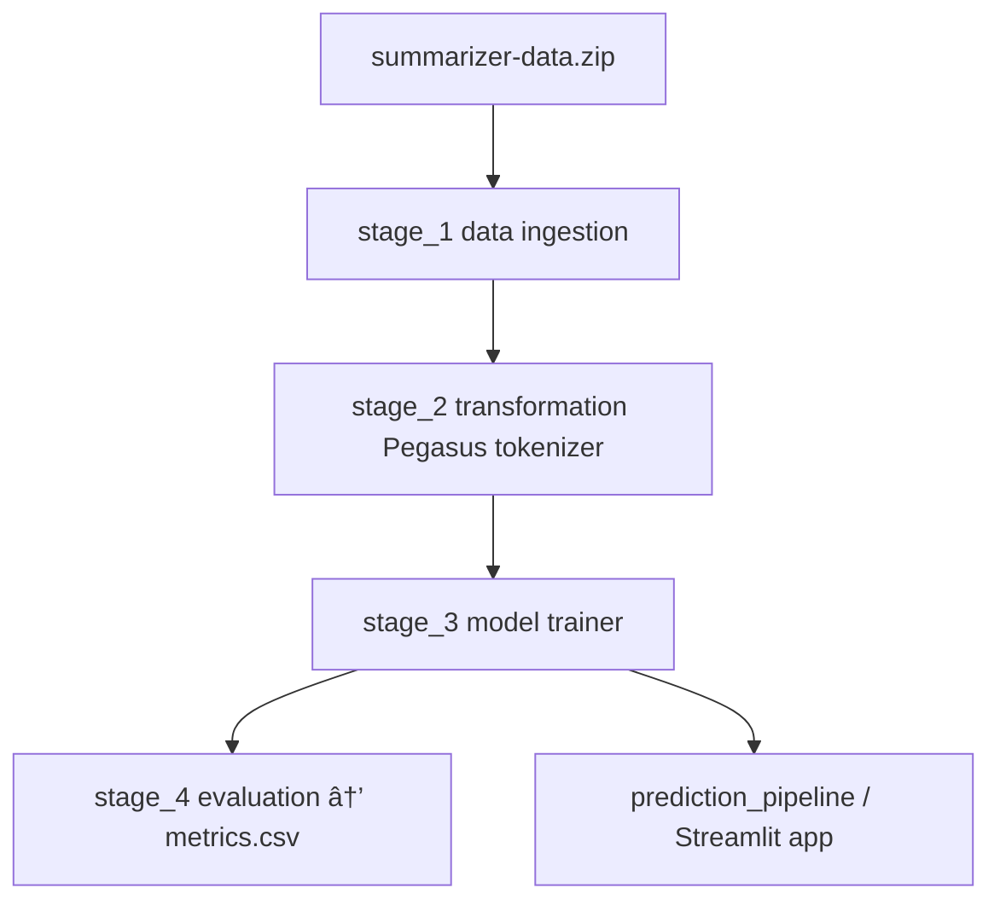
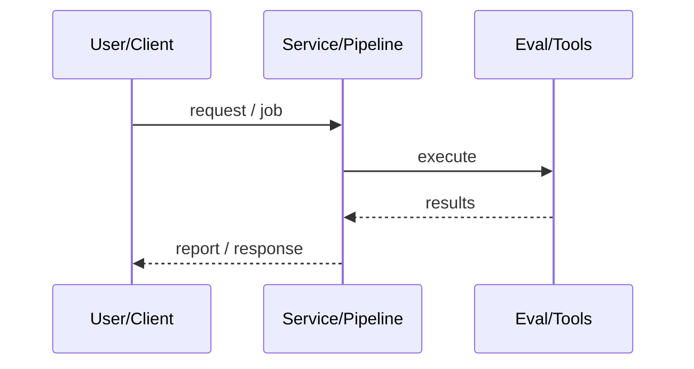
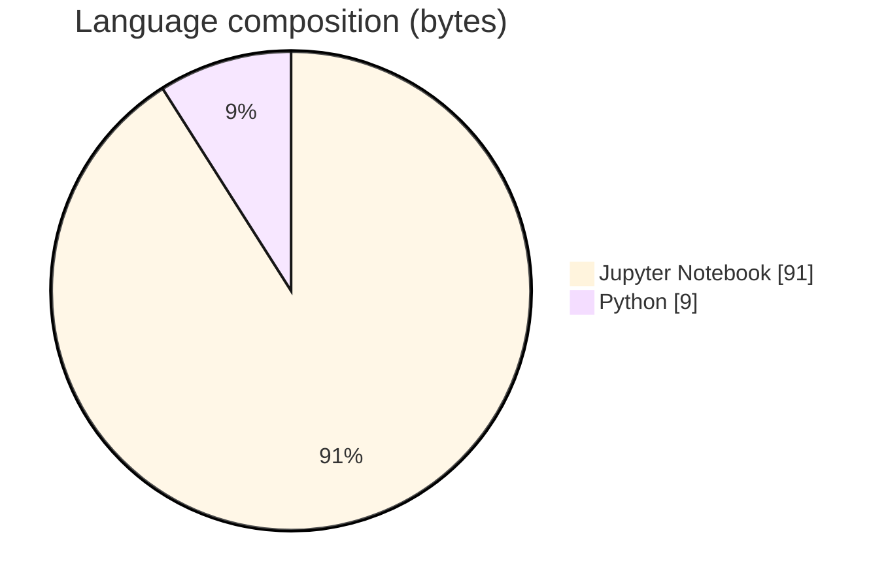

# Pegasus Text Summarizer (Hugging Face Pipeline)

### Modular HF training pipeline fine-tuning google/pegasus-cnn_dailymail on SAMSum-style data.

[](https://github.com/ArchanaChetan07/TextSummarizer-NLP-Transformer-Hugging-face)
[](https://github.com/ArchanaChetan07/TextSummarizer-NLP-Transformer-Hugging-face)
[](https://github.com/ArchanaChetan07/TextSummarizer-NLP-Transformer-Hugging-face)
[](https://github.com/ArchanaChetan07/TextSummarizer-NLP-Transformer-Hugging-face/actions)

---

## Overview

Build a reproducible summarization training + inference stack around Hugging Face Transformers.

src/textSummarizer components for ingestion, transformation, trainer, evaluation; staged pipelines in main.py; config/config.yaml points to summarizer-data.zip / samsum_dataset and Pegasus checkpoint; Streamlit/app.py for inference; research notebooks for each stage.

End-to-end ML project template for abstractive summarization with Docker/CI and GPL-3.0 license.

This repository is maintained as **production-minded portfolio work**: clear architecture, automated checks where present, and metrics that are **traceable to committed artifacts** (never invented).

---

## Architecture

Download zip dataset → tokenize with Pegasus tokenizer → fine-tune trainer → write metrics.csv via evaluation stage → serve summaries through prediction pipeline / app.py.





---

## Results & repository facts

> Only values found in code, configs, tests, or generated reports are listed. Absence of a clinical/ML accuracy number means it was **not** published in-repo.

| Metric | Value | Source |
|---|---|---|
| Tracked repository files | **53** | `git tree` |
| Python modules | **24** | `git tree *.py` |
| Notebooks | **6** | `research/*.ipynb` |
| num_train_epochs | **1** | `params.yaml` |
| per_device_train_batch_size | **1** | `params.yaml` |
| gradient_accumulation_steps | **16** | `params.yaml` |
| warmup_steps | **500** | `params.yaml` |
| weight_decay | **0.01** | `params.yaml` |
| Base model / tokenizer | **google/pegasus-cnn_dailymail** | `config/config.yaml` |
| Tracked files | **53** | `git tree` |
| Python modules | **24** | `git tree` |
| Test-related paths | **1** | `git tree` |
| CI workflows | **Yes** | `.github/workflows` |
| Docker present | **Yes** | `repo root` |



---

## Key features

- 4-stage pipeline: ingest → transform → train → evaluate
- YAML config + TrainingArguments params
- Research notebooks mirroring stages
- Prediction pipeline + Streamlit app

---

## Tech stack

| Layer | Technology |
|---|---|
| nlp | Hugging Face Transformers |
| model | google/pegasus-cnn_dailymail |
| dataset | SAMSum (via summarizer-data.zip) |
| ui | Streamlit |
| containers | Docker |
| ci | GitHub Actions |

---

## Skills demonstrated

Jupyter Notebook · H · u · g · i · n · CI/CD · testing · automation

Keyword surface: **Python · Jupyter Notebook · machine-learning · CI/CD · testing · API · Docker · automation · data-science · software-engineering · system-design · observability · LLM · cloud**

---

## Project structure

```text
TextSummarizer-NLP-Transformer-Hugging-face/
├── main.py / app.py
├── config/config.yaml / params.yaml
├── src/textSummarizer/{components,pipeline,config,utils}/
├── research/*.ipynb
├── Dockerfile / setup.py / LICENSE (GPL-3.0)
└── tests/
```

---

## Installation & usage

```bash
git clone https://github.com/ArchanaChetan07/TextSummarizer-NLP-Transformer-Hugging-face.git
cd TextSummarizer-NLP-Transformer-Hugging-face
pip install -r requirements.txt
python main.py
streamlit run app.py
```

---

## How it works

main.py runs four staged pipelines configured by YAML. Training uses Pegasus CNN/DailyMail weights on the prepared SAMSum-like dataset with short-epoch params. Evaluation is configured to emit artifacts/model_evaluation/metrics.csv (file not committed with scores).

---

## Future improvements

- Commit or publish a filled metrics.csv (ROUGE) after a real training run
- Document GPU memory needs given batch_size=1 + grad_accum=16

---

## License

GPL-3.0.

---

<p align="center">
  <b>Pegasus Text Summarizer (Hugging Face Pipeline)</b><br/>
  <a href="https://github.com/ArchanaChetan07/TextSummarizer-NLP-Transformer-Hugging-face">github.com/ArchanaChetan07/TextSummarizer-NLP-Transformer-Hugging-face</a>
</p>
